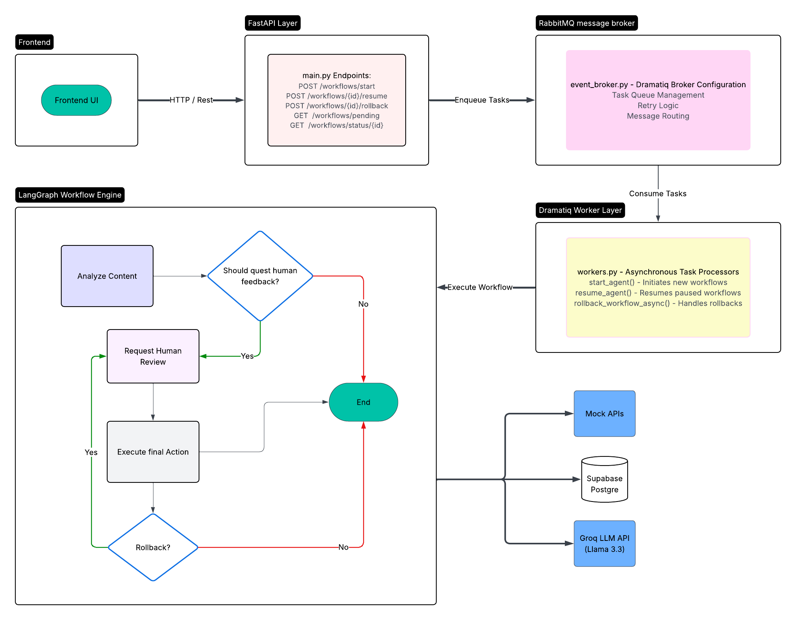
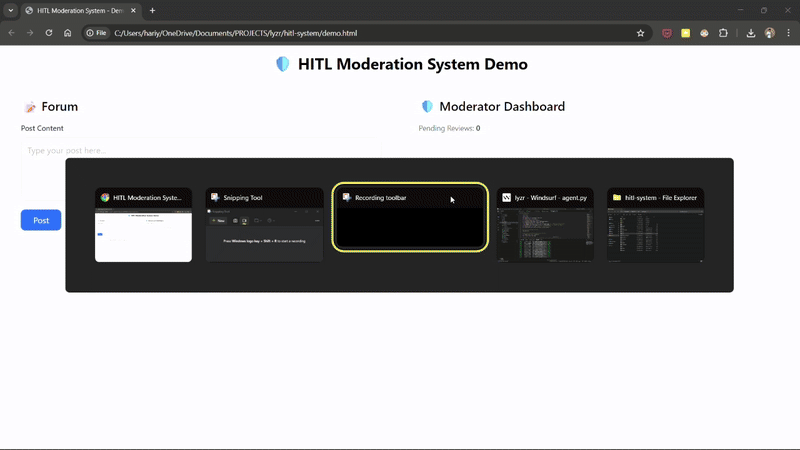

# Human in the Loop Orchestration System

[Demo and explanation Video](https://drive.google.com/file/d/1stYlxnSjx1ZA2cRhctjk8Vg6xX-nCfco/view?usp=sharing)

# Architecture Diagram




## Core Features

* **Stateful Agent Core**: Built with **LangGraph**, the agent has persistent memory, allowing it to be paused and resumed without losing context.

* **Asynchronous & Non-Blocking**: The entire system is event-driven, using **RabbitMQ** and background workers. The API remains fast and responsive, capable of managing thousands of concurrent workflows.

* **Durable Persistence**: Agent state is automatically saved as checkpoints in Supabase **PostgreSQL** database, ensuring resilience against system crashes.

* **Complete Rollback & Appeal Lifecycle**: Rollback mechanism reverts actions and re-queues the case for a second review, creating a full appeal loop.

* **Full Observability**: Integrated with **LangSmith**, providing complete, step-by-step traces of the agent's reasoning process for debugging and auditing.

  

## The "Guardian" Architecture: A Deep Dive

The system is designed as a set of decoupled services communicating through an event bus. This mirrors a professional "Command Center" operation, ensuring scalability and resilience.

* **The Agent (`agent.py`) is the Specialist**: This is the expert analyst (our LangGraph brain). It performs a single task, like analyzing content, and has its own memory (the `GraphState`). It knows its own workflow, including when it needs to stop and ask for orders.

* **The API (`main.py`) is the Front Desk**: This is the public-facing entry point. It receives incoming requests (`/start`, `/resume`, `/rollback`) from the outside world (like a user or another service). It doesn't do any heavy thinking; it simply validates the request and enqueues a task for a background worker.

* **The Workers (`workers.py`) are the Dispatchers**: These are the background operators who do the actual work by listening for messages on the queue.

    * The `start_agent` worker takes a new case and hands it to the Specialist (the agent).
    * The `resume_agent` worker takes a decision from a human and delivers it to the correct paused Specialist.
    * The `rollback_workflow_async` worker handles the complex logic of reversing an agent's actions.

* **RabbitMQ (`event_broker.py`) is the Secure Comms Channel**: This is the message broker connecting the Front Desk to the Dispatchers. It guarantees that messages are delivered reliably and asynchronously, so the API is never blocked waiting for a worker to be free.

  

## The Full Workflow Lifecycle: From Creation to Appeal

The true power of the architecture is demonstrated by its ability to handle a complete, multi-stage workflow.

1.  **Start**: A user posts content. The API receives it and enqueues a `start_agent` task.

2.  **Analyze & Pause**: The agent runs, analyzes the content, and if a violation is detected, it pauses itself by interrupting before the `request_human_review` step. Its state is saved to PostgreSQL.

3.  **Human Decision**: A moderator reviews the case and submits a decision. The API receives this and enqueues a `resume_agent` task.

4.  **Execute**: The resume worker wakes the agent. The agent executes the final action (e.g., `remove_content_api`). The workflow is now `COMPLETED`.

5.  **Appeal & Rollback**: A user or supervisor submits an appeal via the `/rollback` endpoint. This enqueues a `rollback_workflow_async` task.

6.  **Reverse & Re-Pause**: The rollback worker wakes the agent. The agent runs its `rollback` node, which dynamically calls the correct reversal functions for the actions it previously took. It then loops back to the `request_human_review` node and pauses again, waiting for a second, escalated review.


# What was I even thinking?

With the problem statement defined, the first architectural pass was a classic, modular backend. The plan was to build the system in layers:

1.  **The Backbone (Day 1):** Focus on state. The decision to use **PostgreSQL** was made early on due to its ACID compliance, ensuring that a workflow's state could never be corrupted mid-update. The initial schema had two tables: `workflows` for the current state and `audit_log` for history, a pattern that emphasized observability from the start. A **FastAPI** app would serve as the gateway.
2.  **The Engine (Day 2):** Bring it to life. The initial idea was to use **Dramatiq** for orchestration. At this stage, the thinking was more aligned with traditional background task queues—good for "fire-and-forget" tasks.
3.  **The Experience (Day 3):** Build the UI and add resilience.

A key early decision was the development environment. Faced with a potential RAM bottleneck on a development laptop, a **hybrid model** was chosen: run the application code locally for fast iteration, but offload the heavy stateful services (PostgreSQL and RabbitMQ) to free-tier cloud providers like **Supabase** and **CloudAMQP**. This was a crucial trade-off that prioritized development velocity over a fully local setup.

## From Task Queue to Stateful Agent

This was the most significant turning point in the project. While thinking about the limitations of a simple task queue, a realization emerged:

> "Dramatiq excels at fire-and-forget tasks, but what we're building is fundamentally stateful."

A simple worker can *execute* a task, but it doesn't inherently have a persistent "memory" of a long-running, pausable process. This led to the adoption of a more powerful tool for the agent's brain: **LangGraph**.

**The Trade-off:** This introduced a steeper learning curve but offered immense benefits:
* **Formal State Management:** LangGraph forces you to define a state machine, making workflows more robust and predictable.
* **Built-in Persistence:** The concept of "checkpointers" provided a native, elegant solution for saving the agent's memory to our PostgreSQL database.
* **Full Observability:** Integrating **LangSmith** became a natural extension, providing an incredible, step-by-step view into the agent's reasoning process.

This pivot elevated the project from a well-architected web application to a true, modern AI orchestration engine.

## Die debugging

Integrating these powerful new tools brought its own set of challenges:

1.  **The Custom Checkpointer Dead End:** The first attempt to connect LangGraph to Postgres was by writing a custom checkpointer class. This quickly ran into `AttributeError` issues, as the custom class didn't implement all the methods LangGraph's engine expected.
    * **The Fix:** We pivoted to using the official `langgraph-checkpoint-postgres` library. This was a lesson in not reinventing the wheel and trusting battle-tested community tools.

2.  **The "Connection is Closed" Bug:** A classic bug emerged when running the agent in a background task. The database connection was being closed by a `with` statement before the background task had a chance to use it.
    * **The Fix:** This led to a better understanding of Python's context managers and FastAPI's lifecycle. The solution was to move the `with PostgresSaver(...)` block *inside* the background task, ensuring the connection was alive for the duration of the agent's run.

3.  **The Final Pause/Resume Puzzle:** The agent would either run through the entire flow without pausing or resume from the beginning instead of where it left off.
    * **The Fix:** After a few attempts, the definitive solution was found: manually stopping the flow if human_review event is reached.

## Demo

With less than 15 hours left, a final strategic decision was made. The initial plan for a complex, fully-interactive forum frontend was overambitious.

I simplified the frontend to a "dumb" display. Its only jobs were to submit new posts and periodically poll a new `/status` endpoint to show the AI's verdict and the final human decision.

This was a smart trade-off. It allowed the demo to focus on the most impressive parts of the system:
* The **end-to-end data flow**: from a user post to an AI analysis.
* The **asynchronous, non-blocking nature** of the system.
* The **full HITL loop**: pausing for a human and reliably resuming.
* The advanced **rollback and appeal** feature.

This ensured that the project's core architectural strengths were the star of the show, rather than getting lost in frontend complexity. The final result is a testament to this iterative, problem-solving journey: a powerful, resilient, and well-architected system ready for any Human-in-the-Loop challenge.


# Future Improvements

There are a lot of improvement scope. Given more time, this are the things that could be improved:
- Dynamic UI Generation Not yet Implemented, had plans to generate a schema and render it, but was very buggy.
- Database Transactions and Rollback Mechanisms -- Current system is not transactional in nature. Partial failures can lead to inconsistencies. Could've wrapped critical sections in SQLAlchemy transactions.
- There's no timeout and retry logic existing for human review, which isn't ideal at all for production.
- Minor rollback issue if concurrent requests come up.
- Abstraction of Langgraph agent, making it easier to integrate with any systems.
- Caching with Redis (Redis cloud was down, so it was not used).
- Usage of priority Queues to push more important reviews first.
- RabbitMQ failures may result in losing messages during the period, so an outbox pattern could've been used.
- Usage of circuit breakers to prevent overloading the system.

## Getting Started
### 1. Prerequisites

* Python 3.10+
* An active virtual environment
* Access keys for Supabase, CloudAMQP, Groq, and LangSmith.

### 2. Setup
1.  **Clone the repository.**

2.  **Install dependencies**:

    ```bash

    pip install -r requirements.txt

    ```

3.  **Configure Environment**:

    * Create a `.env` file in the `hitl-system` directory.

    * Fill in the required API keys and URLs from your providers (Supabase, CloudAMQP, etc.). A `.env.example` is provided for reference.

### 3. Running the System
The system requires two separate terminal processes to run concurrently.

* **Terminal 1: Start the API Server**

    ```bash

    uvicorn main:app --reload

    ```

* **Terminal 2: Start the Background Workers**

    ```bash

    dramatiq workers -p 1

    ```


You can also interact with the system via the automatically generated API documentation at `http://127.0.0.1:8000/docs` and the included `demo.html` file.
